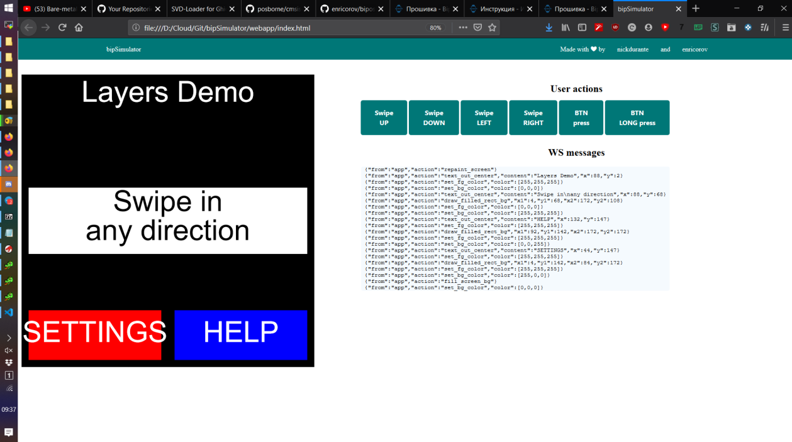

# BipSIM graphics simulator


The Layers Demo app in this screenshot is here: [repo link](https://github.com/enricorov/bipos-layersdemo) 

## Introduction

This is a collection of utilities to view and debug BipOS applications on a PC.

## Usage

Place your \*.c application in `app` and the associated \*.h in `include`. The application needs to include the correct headers and flags, as per [this](https://github.com/enricorov/bipsim-template) template.

## C libraries:

1. [cJSON](https://github.com/DaveGamble/cJSON)
2. [wsServer](https://github.com/Theldus/wsServer)

Both are precompiled in the static library `libws.a`, to compile:

```
cd c_stuff/src
make all
```

To run:
```
cd c_stuff/src/
./bipsim
```

## Run webapp:
Open locally ```webapp/index.html``` and check that the websocket server is running on ```localhost:6789```

## Debug

### Run python ws server
```
cd python_ws_test/
python3 server.py
```

### Send a message to ws

```
cd python_ws_test/
python3 send_message.py '{"type": "message", "content": "rocknroll"}'
```
